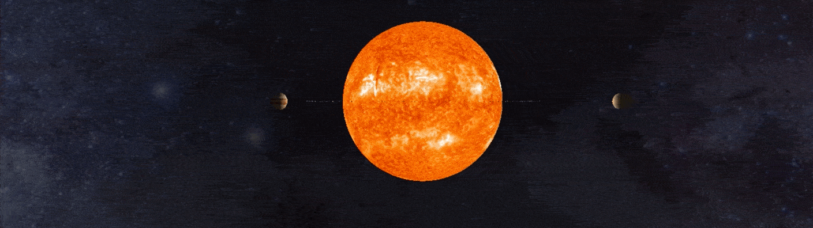

## THREE.js Solar System



Our solar system built using THREE.js. The planets and their orbital speeds are roughly to scale, however distances between planets are significantly scaled down (roughly 1/4 the actual distance) in order to provide a more engaging experience.


[](https://saythanks.io/to/NicholasAdamou)

## Features

This project uses:

- [THREE.js](https://threejs.org)
- [Trackball Controls](https://github.com/gtsop/threejs-trackball-controls)

## Install Dependencies

The following snippet only needs to be ran once if dependencies are not installed:

```bash
yarn install # Installs dependencies
```

## Running the Web App

Simply run, `yarn start` & visit `localhost:8080`.

## License

Solar-System is © 2018, Nicholas Adamou.

It is free software, and may be redistributed under the terms specified in the [LICENSE] file.

[license]: LICENSE
